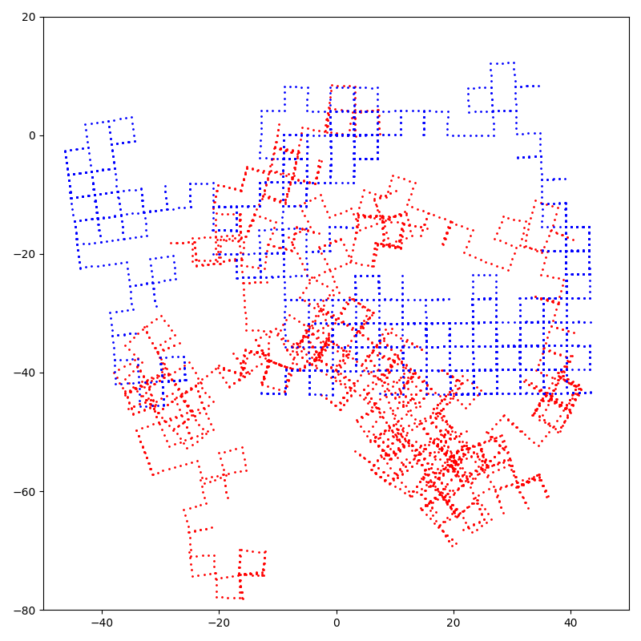

# py-minisam
[](https://github.com/powei-lin/py-minisam/actions?query=workflow%3Aubuntu)

[](https://pypi.org/project/py-minisam)
[](https://pypi.org/project/py-minisam)

-----
Pure python implementation of [minisam](https://github.com/dongjing3309/minisam).



**TODO list**

- [x] gauss_newton_optimizer
- [ ] levenberg_marquardt_optimizer(has bug now)
- [ ] information matrix
- [ ] loss function
- [ ] multithreading

**Table of Contents**

- [Installation](#installation)
- [License](#license)

## Installation

```console
pip install py-minisam
```

## License

`py-minisam` is distributed under the terms of the [MIT](https://spdx.org/licenses/MIT.html) license.
